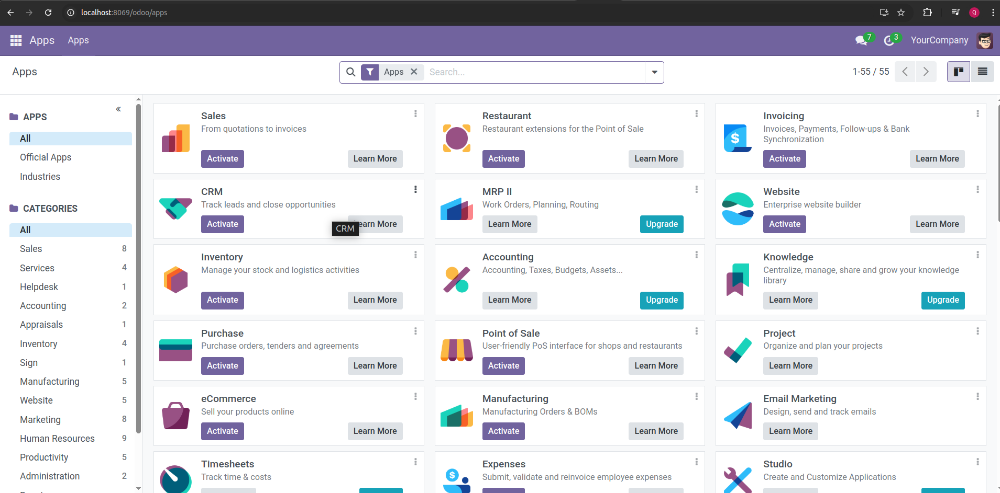

# Getting started

## I. Odoo

Phần mềm Odoo, trước đây được biết đến với tên gọi OpenERP _(Enterprise resource planning (Hoạch định tài nguyên doanh nghiệp))_, là một phần mềm ERP mã nguồn mở (open-source), mang lại khả năng tùy chỉnh và phát triển tính năng một cách vô hạn. Odoo tích hợp sẵn nhiều phân hệ và module cơ bản như POS, CRM, quản lý kho, quản lý dự án, quản lý nhân sự,… và cho phép doanh nghiệp tự do chỉnh sửa, thêm bớt các tính năng hoặc tạo ra những phân hệ mới theo nhu cầu riêng.

### a. Giới thiệu

#### ii. Lịch sử phát triển

Odoo được sáng lập vào năm 2005 bởi Fabien Pinckaers, khởi đầu với tên gọi TinyERP – một hệ thống quản trị doanh nghiệp tổng thể mã nguồn mở. Đến năm 2008, TinyERP đổi tên thành OpenERP và đến năm 2014, phần mềm chính thức mang tên Odoo, mở rộng thêm các ứng dụng CRM, Website và E-commerce (Thương mại điện tử).

Odoo sử dụng ngôn ngữ lập trình Python, được đánh giá cao nhờ tính dễ đọc, dễ học, khả năng mở rộng và tốc độ xử lý nhanh chóng. Phần mềm có thể tích hợp với các ngôn ngữ lập trình khác và hỗ trợ công nghệ điện toán đám mây, cho phép doanh nghiệp quản lý các hoạt động vận hành trực tuyến mọi lúc, mọi nơi.

Với hơn 7 triệu người dùng trên toàn thế giới, từ các công ty khởi nghiệp đến các doanh nghiệp lớn, Odoo hỗ trợ 23 ngôn ngữ và cho phép người dùng chỉnh sửa nội dung từ bất kỳ đâu. Odoo cũng tích hợp với các nền tảng thương mại điện tử lớn như Amazon và eBay, đồng thời cung cấp API cho các nhà phát triển.

### b. Yêu cầu về tài nguyên

- Tính toán số lượng worker

Nguyên tắc chung : (#CPU \* 2) + 1

Cron workers cần CPU

1 worker ~= 6 users đồng thời

Tính toán bộ nhớ
Giả sử 20% là các yêu cầu tính toán nặng (mất nhiều thời gian response) trogn khi 80% là các yêu câu nhẹ hơn:

- 1 worker chịu tải cao thường tiêu thụ khoảng 1GB RAM
- 1 worker chịu tải nhẹ hơn cùng ngữ cảnh sẽ tiêu thụ khoảng 150MB RAM

Công thức tính lượng RAM cần thiết

```
RAM = #worker * ( (light_worker_ratio * light_worker_ram_estimation) + (heavy_worker_ratio * heavy_worker_ram_estimation) )
```

Ví dụ:

- Server với 4 CPU, 8 Thread

  60 users đồng thời

  60 users / 6 = 10 <- Số lượng workers cần thiết

  (4 \* 2) + 1 = 9 <- Số lượng workers tối đa lý thuyết

  Kết quả sẽ dùng 8 workers + 1 cho cron. (Cần check thực tế bằng các công cụ monitor xem có đúng không)

  => RAM = 9 * ((0.8*150) + (0.2\*1024)) ~= 3Go RAM cho Odoo

[Worker number calculation](https://www.odoo.com/documentation/18.0/administration/on_premise/deploy.html#worker-number-calculation)

### b. Cài đặt ở host

> Cài đặt với nhu cầu development với Ubuntu 22.04. Lưu ý với Ubuntu 22.04 sẽ bị lỗi khi install thư viện gevent và greenlet. Cần comment 2 thư viện này trong [requirments.txt](/odoo18/requirements.txt) và cài đặt như sau:

```sh
pip3 install -r odoo18/requirements.txt
pip3 install gevent==22.10.2
pip3 install greenlet==2.0.2
```

1. Cập nhật hệ thống

```sh
sudo apt-get update
sudo apt-get upgrade -y
```

2. Cài đặt các packages

```sh
sudo apt-get install -y git python3-pip python3-dev libxml2-dev libxslt1-dev zlib1g-dev libsasl2-dev libldap2-dev build-essential libssl-dev libffi-dev libmysqlclient-dev libjpeg-dev libpq-dev libjpeg8-dev liblcms2-dev libblas-dev libatlas-base-dev npm
```

3. Cài đặt Node.js và các công cụ liên quan

```sh
sudo ln -s /usr/bin/nodejs /usr/bin/node
sudo npm install -g less less-plugin-clean-css
sudo apt-get install -y node-less
```

4. Cài đặt và cấu hình PostgreSQL

```sh
sudo apt-get install -y postgresql postgresql-client
sudo su - postgres -c "createuser -s odoo18"
su postgres
ALTER ROLE odoo18 WITH PASSWORD 'admin';
```

5. Cài đặt Wkhtmltopdf để tạo báo cáo PDF (Optional)

```sh
sudo wget https://github.com/wkhtmltopdf/wkhtmltopdf/releases/download/0.12.5/wkhtmltox_0.12.5-1.bionic_amd64.deb
sudo dpkg -i wkhtmltox_0.12.5-1.bionic_amd64.deb
sudo apt-get install -f
```

6. Tạo người dùng hệ thống cho odoo

```sh
sudo useradd -m -d /opt/odoo18 -U -r -s /bin/bash odoo18
```

7. Tải mã nguồn odoo

- Chuyển sang user `odoo18` và tải mã nguồn odoo

```
sudo su - odoo18
git clone https://www.github.com/odoo/odoo --depth 1 --branch 18.0 odoo18
```

8. Thiết lập môi trường ảo Python và cài đặt các thư viện

```
python3 -m venv odoo18-venv
source odoo18-venv/bin/activate
pip3 install wheel
pip3 install -r odoo18/requirements.txt
deactivate
```

10. Cấu hình odoo

```sh
cd odoo/debian
nano odoo.conf
# Add or modify the following: [options]
db_user = odoo18
db_password = admin
addons_path = /opt/odoo18/odoo18/addons
```

11. Chạy odoo

```sh
source odoo18-venv/bin/activate
cd odoo18
python3 odoo-bin -c debian/odoo.conf
```

12. Kết quả
    

### c. Triển khai với container

- Sử dụng docker compose để triển khai Odoo và postgreSQL

```yaml
services:
  db:
    image: postgres
    restart: always
    environment:
      POSTGRES_USER: odoo
      POSTGRES_PASSWORD: odoo
      POSTGRES_DB: odoo
    volumes:
      - odoo-db-data:/var/lib/postgresql/data
    networks:
      - odoo-net

  odoo:
    image: odoo:18
    restart: always
    ports:
      - "8069:8069"
    environment:
      - HOST=db
      - USER=odoo
      - PASSWORD=odoo
    volumes:
      - odoo-data:/var/lib/odoo
      - ./config/odoo.conf:/etc/odoo/odoo.conf
    depends_on:
      - db
    networks:
      - odoo-net

networks:
  odoo-net:
    driver: bridge

volumes:
  odoo-db-data:
  odoo-data:
```

với file `odoo.conf`

```conf
[options]
; This is the password that allows database operations:
admin_passwd = admin
db_host = db
db_port = 5432
db_user = odoo
db_password = admin
db_name = False
addons_path = /mnt/extra-addons,/opt/odoo/addons
logfile = /var/log/odoo/odoo.log
```

- Khi phát triển hoặc thêm các module tùy chỉnh vào Odoo, chỉ cần thêm chúng vào thư mục `extra-addons` trong tệp cấu hình và ánh xạ thư mục vào container Docker.

```yaml
volumes:
  - odoo-data:/var/lib/odoo
  - ./config/odoo.conf:/etc/odoo/odoo.conf
  - ./extra-addons:/mnt/extra-addons
```

Khi này, thư mục phát triển (chứa docker-compose file) sẽ có cấu trúc như sau:

```
.
├── config/
│   └── odoo.conf
├── odoo-db-data/
├── odoo-data/
└── extra-addons/
```

### d. Đóng gói Odoo cùng với addons

- Đóng gói với dockerfile

```Dockerfile

```

```
docker build -t custom-odoo .
```

### e. Yêu cầu về tài nguyên phần cứng

| Criteria             | Up to 10 Users                   | Up to 50 Users                   | More than 50 Users                |
| -------------------- | -------------------------------- | -------------------------------- | --------------------------------- |
| **CPU**              | Dual-core CPU                    | Quad-core CPU                    | Quad-core or higher CPU           |
| **RAM (Memory)**     | 2 GB or more                     | 4-8 GB or more                   | 16 GB or more                     |
| **Storage**          | 10 GB or more                    | 20 GB or more                    | 50 GB or more (depending on data) |
| **Network**          | Stable internet connection       | Stable internet connection       | Stable internet connection        |
| **Operating System** | Linux (e.g., Ubuntu or CentOS)   | Linux (e.g., Ubuntu or CentOS)   | Linux (e.g., Ubuntu or CentOS)    |
| **Database**         | PostgreSQL                       | PostgreSQL                       | PostgreSQL                        |
| **Additional Notes** | SSDs for improved DB performance | SSDs for improved DB performance | SSDs for improved DB performance  |
|                      | Regular backups and monitoring   | Regular backups and monitoring   | Regular backups and monitoring    |

[Source](https://erpixel.com/odoo-server-requirements/)

## II. NextCloud

### a. Giới thiệu

### b. Cài đặt

### III. Bài toán

Phương án triển khai & phát triển Odoo & NextCloud

- Đóng gói triển khai Odoo & NextCloud ntn: tài nguyên tối thiểu bnh?, Docker hay K8s, tự động hoá triển khai & cấu hình ntn, nâng cấp sau ntn, kịch bản Vận hành sau triển khai đảm bảo dịch vụ 24/7, tải đáp ứng ntn?
- Lựa chọn các module Odoo sẽ triển khai?
- Lựa chọn các module NextCloud sẽ triển khai?
- Tài liệu phát triển Odoo: dựng môi trường ntn, nâng cấp 1 module đã có mã nguồn mở ntn, phát triển thêm 1 module mới ntn?
- HDSD cho người dùng
- Checklist nghiệm thu

* Tính năng
* Tài liệu
* Nghiệm thu trên hệ thống thật
* Nghiệm thu đóng gói (tài liệu triển khai, cấu hình, tài liệu phát triển)
